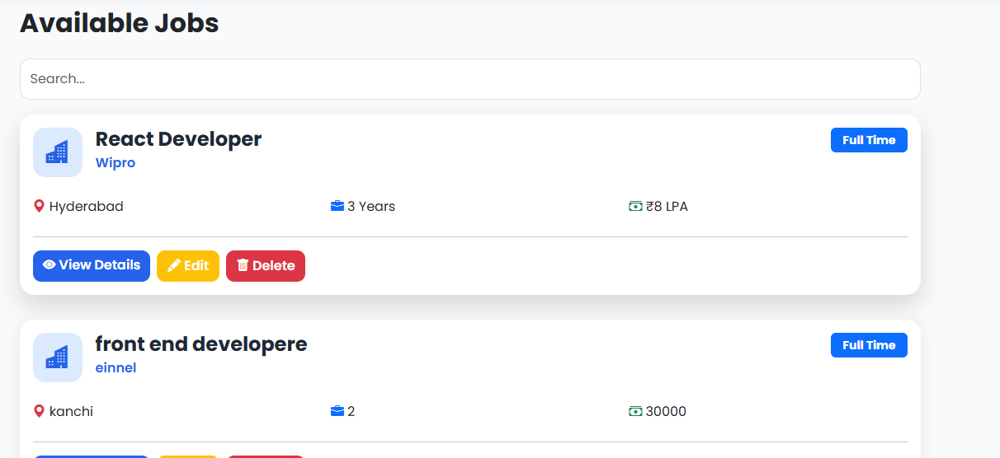
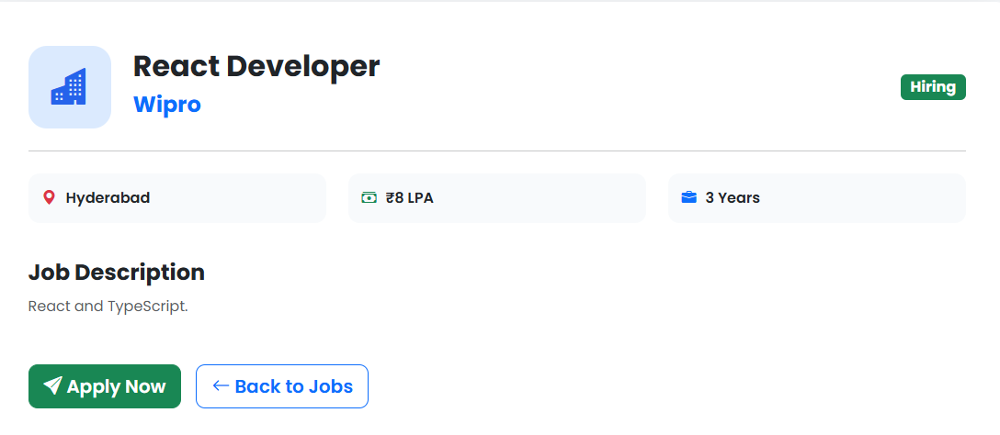
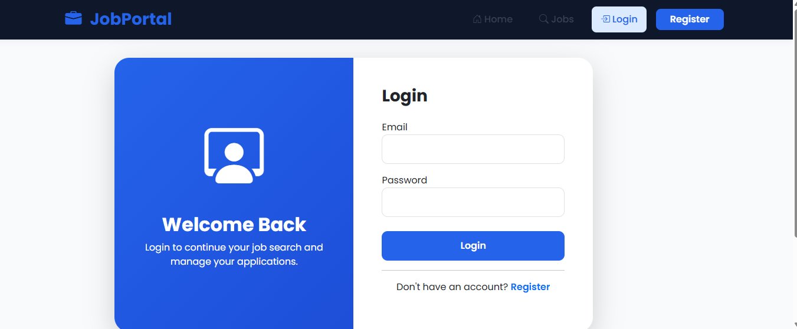
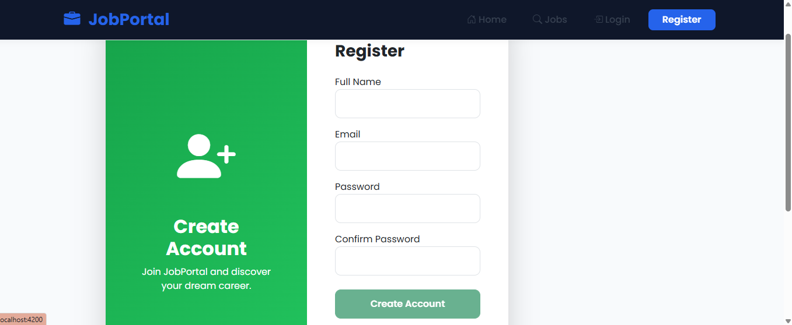
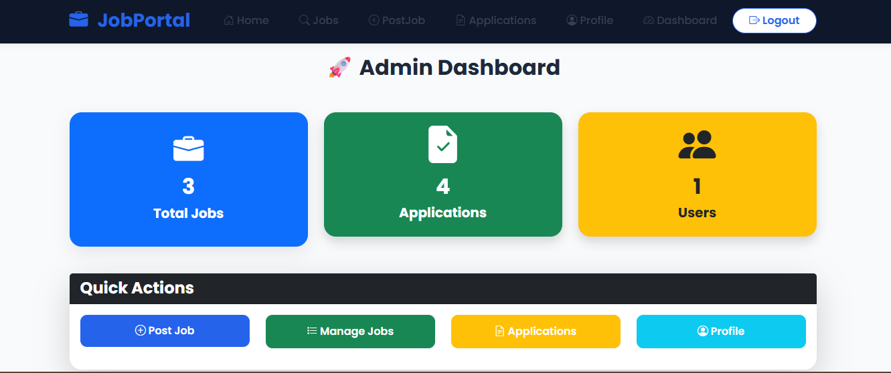
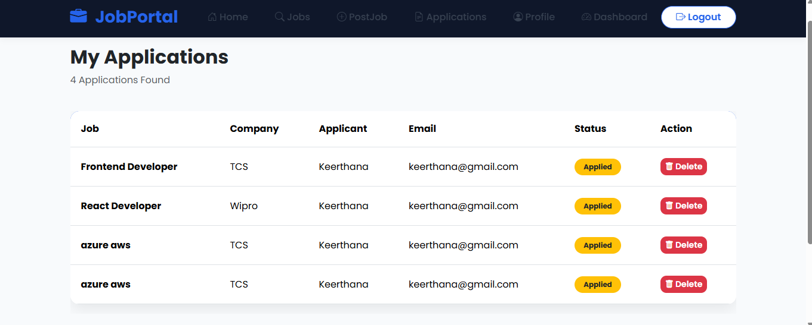
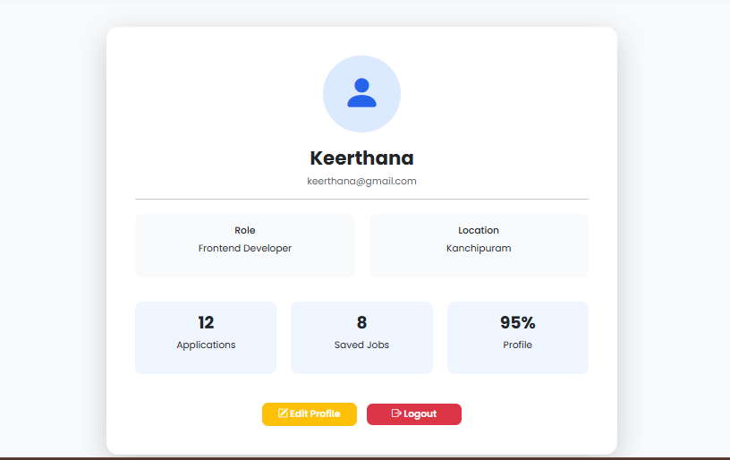

# 💼 Angular Job Portal

A modern and responsive Job Portal web application built with **Angular 20**. It allows users to browse jobs, apply for positions, manage applications, and provides an admin dashboard for managing job postings.

---

## 🚀 Features

### User Features
- User Registration & Login
- Browse Available Jobs
- Search Jobs by Title, Company, Location, and Experience
- View Job Details
- Apply for Jobs
- View My Applications
- Delete Applications
- User Profile
- Responsive Design

### Admin Features
- Admin Dashboard
- Post New Jobs
- Edit Existing Jobs
- Delete Jobs
- View Job Statistics
- Manage Applications

### UI Features
- Modern Responsive UI
- Sticky Navigation Bar
- Hero Section
- Statistics Cards
- Bootstrap Icons
- SweetAlert2 Popups
- Loading Spinner
- Responsive Bootstrap Layout

---

## 🛠️ Technologies Used

- Angular 20
- TypeScript
- HTML5
- CSS3
- Bootstrap 5
- Bootstrap Icons
- JSON Server
- RxJS
- Angular Router
- Angular Forms
- SweetAlert2

---

## 📂 Project Structure

```
job-portal-app/
│
├── .angular/
├── .vscode/
├── node_modules/
│
├── public/
│
├── src/
│   │
│   ├── app/
│   │   │
│   │   ├── components/
│   │   │   │
│   │   │   ├── footer/
│   │   │   │   ├── footer.ts
│   │   │   │   ├── footer.html
│   │   │   │   └── footer.css
│   │   │   │
│   │   │   ├── navbar/
│   │   │   │   ├── navbar.ts
│   │   │   │   ├── navbar.html
│   │   │   │   └── navbar.css
│   │   │   │
│   │   │   └── job-card/
│   │   │       ├── job-card.ts
│   │   │       ├── job-card.html
│   │   │       └── job-card.css
│   │   │
│   │   │
│   │   ├── models/
│   │   │   ├── application.ts
│   │   │   ├── job.ts
│   │   │   └── user.ts
│   │   │
│   │   ├── pages/
│   │   │   │
│   │   │   ├── home/
│   │   │   │   ├── home.ts
│   │   │   │   ├── home.html
│   │   │   │   └── home.css
│   │   │   │
│   │   │   ├── jobs/
│   │   │   │   ├── jobs.ts
│   │   │   │   ├── jobs.html
│   │   │   │   └── jobs.css
│   │   │   │
│   │   │   ├── job-details/
│   │   │   │   ├── job-details.ts
│   │   │   │   ├── job-details.html
│   │   │   │   └── job-details.css
│   │   │   │
│   │   │   ├── post-job/
│   │   │   │   ├── post-job.ts
│   │   │   │   ├── post-job.html
│   │   │   │   └── post-job.css
│   │   │   │
│   │   │   ├── edit-job/
│   │   │   │   ├── edit-job.ts
│   │   │   │   ├── edit-job.html
│   │   │   │   └── edit-job.css
│   │   │   │
│   │   │   ├── login/
│   │   │   │   ├── login.ts
│   │   │   │   ├── login.html
│   │   │   │   └── login.css
│   │   │   │
│   │   │   ├── register/
│   │   │   │   ├── register.ts
│   │   │   │   ├── register.html
│   │   │   │   └── register.css
│   │   │   │
│   │   │   ├── profile/
│   │   │   │   ├── profile.ts
│   │   │   │   ├── profile.html
│   │   │   │   └── profile.css
│   │   │   │
│   │   │   ├── my-applications/
│   │   │   │   ├── my-applications.ts
│   │   │   │   ├── my-applications.html
│   │   │   │   └── my-applications.css
│   │   │   │
│   │   │   ├── admin-dashboard/
│   │   │   │   ├── admin-dashboard.ts
│   │   │   │   ├── admin-dashboard.html
│   │   │   │   └── admin-dashboard.css
│   │   │
│   │   ├── services/
│   │   │   ├── application.ts
│   │   │   ├── auth.service.ts
│   │   │   └── job.ts
│   │   │
│   │   ├── app.config.ts
│   │   ├── app.css
│   │   ├── app.html
│   │   ├── app.routes.ts
│   │   └── app.ts
│   │
│   ├── assets/
│   │   ├── images/
│   │   │   ├── hero-job.png
│   │   │   ├── company1.png
│   │   │   ├── company2.png
│   │   │   ├── company3.png
│   │   │   └── profile.png
│   │   │
│   │   └── icons/
│   │
│   ├── favicon.ico
│   ├── index.html
│   ├── main.ts
│   └── styles.css
│
├── db.json
├── angular.json
├── package.json
├── package-lock.json
├── tsconfig.json
├── tsconfig.app.json
├── tsconfig.spec.json
├── README.md
└── .gitignore
```

---

## ⚙️ Installation

### Clone Repository

```bash
git clone https://github.com/keerthana651/angular-job-portal.git
```

### Go to Project

```bash
cd angular-job-portal
```

### Install Dependencies

```bash
npm install
```

### Start JSON Server

```bash
npx json-server --watch db.json --port 3000
```

### Run Angular

```bash
ng serve
```

Open your browser:

```
http://localhost:4200
```

---

# 📷 Screenshots

## Home Page


---

## Jobs Page



---

## Job Details



---

## Login



---

## Register



---

## Admin Dashboard



---

## My Applications



---

## Profile


## 📌 Future Improvements

- JWT Authentication
- Role-Based Access Control
- Backend Integration (.NET / Node.js)
- Email Notifications
- Resume Upload
- Company Profiles
- Dark Mode
- Pagination
- Advanced Filters

---

## 👩‍💻 Author

**Keerthana**

Frontend Developer

GitHub: https://github.com/keerthana651/angular-job-portal

LinkedIn: https://www.linkedin.com/in/keerthana-arivazhagan-847813411/

---

## ⭐ If you like this project

Please give this repository a ⭐ on GitHub.

## Development server

To start a local development server, run:

```bash
ng serve
```

Once the server is running, open your browser and navigate to `http://localhost:4200/`. The application will automatically reload whenever you modify any of the source files.

## Code scaffolding

Angular CLI includes powerful code scaffolding tools. To generate a new component, run:

```bash
ng generate component component-name
```

For a complete list of available schematics (such as `components`, `directives`, or `pipes`), run:

```bash
ng generate --help
```

## Building

To build the project run:

```bash
ng build
```

This will compile your project and store the build artifacts in the `dist/` directory. By default, the production build optimizes your application for performance and speed.

## Running unit tests

To execute unit tests with the [Karma](https://karma-runner.github.io) test runner, use the following command:

```bash
ng test
```

## Running end-to-end tests

For end-to-end (e2e) testing, run:

```bash
ng e2e
```

Angular CLI does not come with an end-to-end testing framework by default. You can choose one that suits your needs.

## Additional Resources

For more information on using the Angular CLI, including detailed command references, visit the [Angular CLI Overview and Command Reference](https://angular.dev/tools/cli) page.
